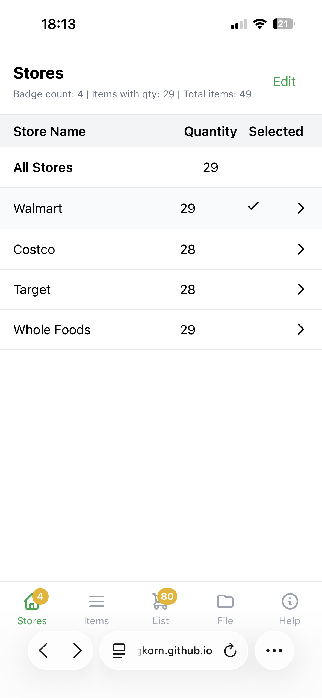
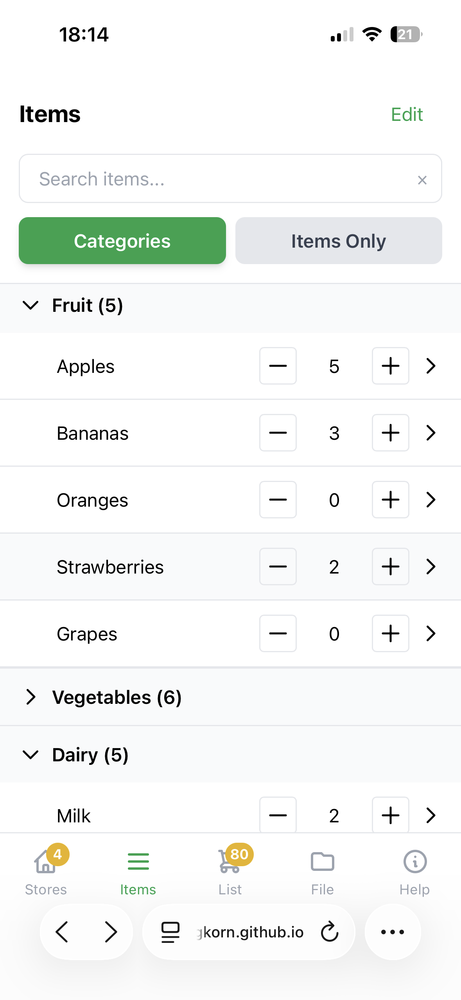
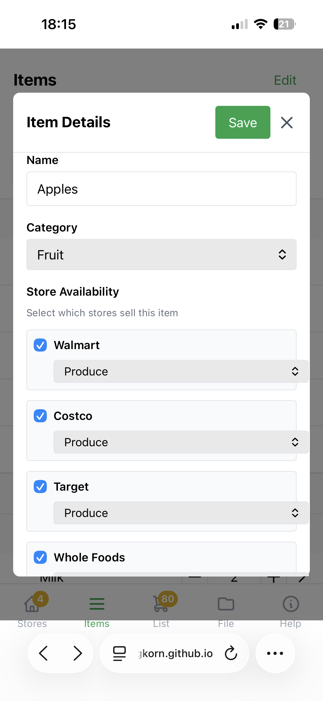
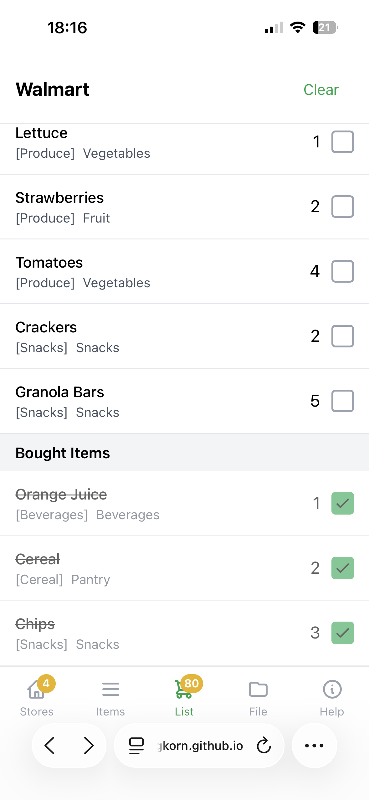
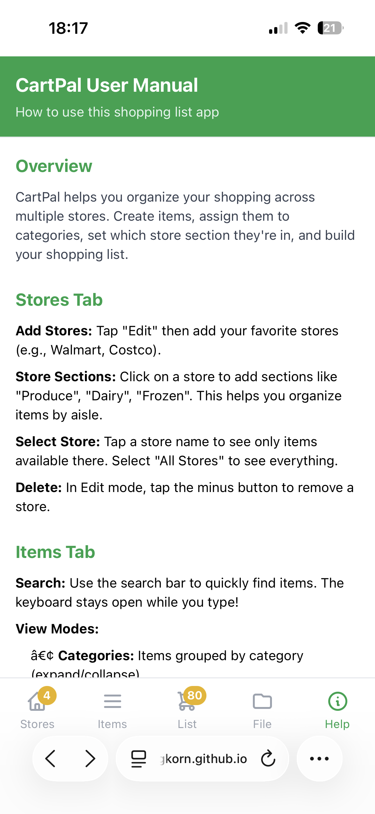

# 🛒 CartPal

**The shopping list app refined over 20+ years of real-world use**

[](https://japiekingkorn.github.io/cartpal)
[](https://opensource.org/licenses/MIT)
[](https://reactjs.org/)

---

## 🎯 Why CartPal?

After trying dozens of shopping list apps over two decades, I kept coming back to the same simple concept: **organize items by store sections, work offline, and stay out of my way.**

Most apps today are either too basic (just a text list) or overcomplicated (recipe integrations, meal planning, price tracking, social features). CartPal sits in the sweet spot: powerful enough to handle multiple stores efficiently, simple enough to use without thinking.

### The Journey

This isn't a fresh idea—it's a battle-tested concept:

- **2003**: Started using a shopping list app on my Palm PDA
- **2008-2017**: Continued on Google Nexus alongside my first smartphone
- **2017-2024**: Found a similar app on iPhone that worked perfectly
- **2024**: iOS 18.0.1 update broke compatibility
- **Now**: Recreated the core functionality that made those apps irreplaceable

I've tried countless alternatives (AnyList, OurGroceries, Bring!, Listonic, and many more). They're not bad apps—they just solve different problems. CartPal focuses on one thing: getting through your shopping trip efficiently, even when your phone has no signal.

---

## ✨ What Makes CartPal Different?

### 🔌 **Offline First**
No account needed. No cloud. No internet required. Your data stays on your device. Period.

### 🏪 **Store-Centric Organization**
- Define your regular stores (Albert Heijn, Jumbo, Lidl, etc.)
- Add sections to each store (Produce, Dairy, Frozen, etc.)
- Items automatically organize by section when you shop
- See at a glance which stores you need to visit

### 📦 **Smart Item Management**
- Assign items to categories for easy browsing
- Mark which stores sell each item
- Set store section per item (no more backtracking!)
- Search instantly without keyboard closing (mobile-optimized)

### 🎯 **Zero Learning Curve**
If you've used a grocery list before, you already know how to use CartPal. No tutorials, no onboarding, no "getting started" docs needed.

### 💾 **True Data Ownership**
- Export your entire database as CSV
- Import data from backups
- No vendor lock-in
- Works in 2024, will work in 2034

---

## 📱 Screenshots

### Store Management

*Organize your stores and see where you need to shop*

### Item Organization

*Browse by category or search all items at once*

### Item Details

*Assign items to stores and sections*

### Shopping List

*Your list, organized by aisle for efficient shopping*

### Overview

*Everything at your fingertips*

---

## 🚀 Getting Started

### Try It Now
**[Launch CartPal](https://japiekingkorn.github.io/cartpal)** - No installation required!

### Install as PWA (Progressive Web App)

**On iPhone/iPad:**
1. Open CartPal in Safari
2. Tap the Share button
3. Scroll down and tap "Add to Home Screen"
4. Tap "Add"

**On Android:**
1. Open CartPal in Chrome
2. Tap the three-dot menu
3. Tap "Install app" or "Add to Home screen"

**On Desktop:**
1. Open CartPal in Chrome/Edge
2. Click the install icon in the address bar
3. Click "Install"

---

## 📖 How It Works

### 1️⃣ **Set Up Your Stores**
- Add the stores you regularly visit
- Define sections in each store (Produce, Bakery, Frozen, etc.)

### 2️⃣ **Build Your Item Library**
- Create categories (Vegetables, Snacks, Beverages)
- Add items and assign them to categories
- Mark which stores sell each item
- Set the section where you find them

### 3️⃣ **Create Your Shopping List**
- Adjust quantities using +/- buttons
- Select your target store
- View items organized by section

### 4️⃣ **Shop Efficiently**
- Follow the list section by section
- Check off items as you add them to cart
- No more backtracking through the store!

### 5️⃣ **Repeat**
- After shopping, tap "Clear" to reset
- Your item library stays intact
- Next time, just adjust quantities again

---

## 🔒 Privacy & Data

### What CartPal Does NOT Do:
- ❌ No account creation
- ❌ No cloud sync
- ❌ No data collection
- ❌ No analytics
- ❌ No tracking
- ❌ No ads
- ❌ No internet connection required

### What CartPal DOES Do:
- ✅ Stores all data locally on your device
- ✅ Allows CSV export for backups
- ✅ Works completely offline
- ✅ Respects your privacy

Your grocery list is nobody's business but yours.

---

## 💾 Data Management

### Export Your Data
Go to the **File** tab and tap **Export CSV**. Save this file somewhere safe (cloud storage, email to yourself, etc.).

### Import Data
Go to the **File** tab, tap **Import CSV**, and select your previously exported file.

### CSV Format
CartPal uses a simple CSV format:
```
Name,Quantity,Category,Store1 cost,Store1 section,Store2 cost,Store2 section
Apples,5,Fruit,€ 0.00,Produce,€ 0.00,Fruit & Veg
Milk,2,Dairy,€ 0.00,Dairy,€ 0.00,
```

This makes it easy to edit in Excel or Google Sheets if needed.

---

## 🛠️ Technical Details

### Built With
- **React 18** - UI framework
- **Tailwind CSS** - Styling
- **localStorage** - Data persistence
- **Vanilla JavaScript** - No build process needed!

### Single File Architecture
CartPal is intentionally built as a single HTML file. This means:
- No dependencies to install
- No build process required
- Easy to host anywhere
- Download and run locally if you want
- Simple to fork and customize

### Browser Support
Works on any modern browser (Chrome, Safari, Firefox, Edge). Tested extensively on:
- iPhone 15 (iOS 18+)
- Android devices
- Desktop browsers

---

## 🤝 Contributing

Found a bug? Have an idea? Contributions are welcome!

### Ways to Help
- 🐛 Report bugs via [GitHub Issues](https://github.com/japiekingkorn/cartpal/issues)
- 💡 Suggest features
- 🔧 Submit pull requests
- 📖 Improve documentation
- 🌍 Translate to other languages
- ⭐ Star the repo if you find it useful!

### Development
1. Fork the repository
2. Make your changes to `index.html`
3. Test locally (just open in browser)
4. Submit a pull request

No complex setup needed—it's just one HTML file!

---

## 💝 Enjoying CartPal?

CartPal is completely free and always will be. No ads, no premium features, no subscriptions, no donations needed.

If you find it useful, the best way to support the project is to:
- ⭐ Star the repository on GitHub
- 🐛 Report bugs or suggest features
- 📢 Share it with friends who might find it helpful
- 💬 Leave feedback on what works (or doesn't!)

---

## 📜 License

MIT License - see [LICENSE](LICENSE) file for details.

Feel free to use, modify, and distribute as you wish. If you build something cool based on CartPal, I'd love to hear about it!

---

## 🙏 Credits

Inspired by the shopping list apps I've used since 2003, particularly the one that worked perfectly until iOS 18 broke it. This is my attempt to preserve that workflow for myself and share it with others who think the same way.

Special thanks to:
- The original developers whose work inspired this concept
- Everyone who's tried CartPal and provided feedback
- The open source community for making projects like this possible

---

## 📞 Contact

**Japie** (japiekingkorn)
- GitHub: [@japiekingkorn](https://github.com/japiekingkorn)
- Issues: [Report a bug](https://github.com/japiekingkorn/cartpal/issues)

---

## 🗺️ Roadmap

Potential future features (based on user feedback):
- [ ] Multiple list support (grocery, hardware, etc.)
- [ ] Dark mode
- [ ] Recipe integration
- [ ] Barcode scanner (maybe)
- [ ] Cloud backup option (optional, not required)
- [ ] Collaborative lists (share with family)

**Note:** These are ideas, not promises. CartPal's core philosophy is simplicity. Features will only be added if they don't compromise that.

---

## ❓ FAQ

### Why not use Google Keep / Apple Reminders?
They're great for quick lists, but they don't organize by store sections or track which stores sell which items.

### Why not use AnyList / OurGroceries?
Those are excellent apps with more features. CartPal is for people who want something simpler and offline-focused.

### Can I sync between devices?
Not yet. Right now, use CSV export/import to transfer data. Cloud sync might come as an optional feature.

### Will this always be free?
Yes. No ads, no premium tiers, no subscriptions. Ever.

### Can I use this commercially?
Yes, it's MIT licensed. Fork it, sell it, do what you want. (Though I'd appreciate credit!)

### What if the app stops working?
You can always export your data as CSV. Plus, since it's open source, you or someone else can maintain it.

---

<div align="center">

**Made with ❤️ by someone who just wants to shop efficiently**

[Try CartPal Now](https://japiekingkorn.github.io/cartpal) | [Report Issue](https://github.com/japiekingkorn/cartpal/issues) | [⭐ Star on GitHub](https://github.com/japiekingkorn/cartpal)

</div>
